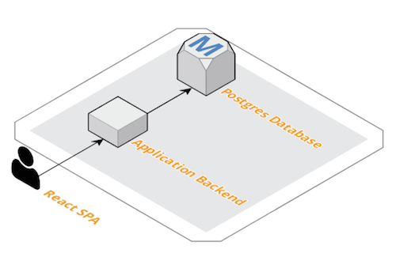

# TechTestApp

[![Build Status][circleci-badge]][circleci]
[![Release][release-badge]][release]
[![GoReportCard][report-badge]][report]
[![License][license-badge]][license]

[circleci-badge]: https://circleci.com/gh/vibrato/TechTestApp.svg?style=shield&circle-token=8dfd03c6c2a5dc5555e2f1a84c36e33bc58ad0aa
[circleci]: https://circleci.com/gh/vibrato/TechTestApp
[release-badge]: http://img.shields.io/github/release/vibrato/TechTestApp/all.svg?style=flat
[release]:https://github.com/vibrato/TechTestApp/releases
[report-badge]: https://goreportcard.com/badge/github.com/vibrato/TechTestApp
[report]: https://goreportcard.com/report/github.com/vibrato/TechTestApp
[license-badge]: https://img.shields.io/github/license/vibrato/TechTestApp.svg?style=flat
[license]: https://github.com/vibrato/TechTestApp/license

The Vibrato techtest app is a golang application used for testing candidates applying to work with Vibrato.

## Tech Test Application

Single page application designed to be ran inside a container or on a vm (IaaS) with a postgres database to store data.

It is completely self contained, and should not require any additional dependencies to run.

## Install

1. Download latest binary from release
2. unzip into desired location
3. and you should be good to go

## Start server

update `conf.toml` with database settings

`./TechTestApp updatedb` to create a database and seed it with test data

`./TechTestApp serve` will start serving requests

## Interesting endpoints

`/` - root endpoint that will load the SPA

`/api/tasks/` - api endpoint to create, read, update, and delete tasks

`/healthcheck/` - Used to validate the health of the application

## Repository structure

``` python
.
├── assets      # Asset directory for the application
│   ├── css     # Contains all the css files for the web site
│   ├── images  # Contains all the images for teh web site
│   └── js      # Contains all the react javascript files
├── cmd         # Command line UI logic is managed in this location
├── config      # Contains the configuration logic for he application
├── daemon      # Contains the logic of the daemon that runs and controll the app
├── db          # Contains the data layet and db connectivity logic
├── doc         # Documentation folder
├── model       # Data model for the application
├── scaffolds   # Scaffolds for deplying the application onto the cloud
└── ui          # Web UI, routing, connectivity
```

## Application Architecture



The application itself is a React based single page application (SPA) with an API backend and a postgres database used for data persistence. It's been designed to be completely stateless and will deploy into most types of environments, be it container based or VM based.

## Deploying into the cloud - scaffolds

The scaffolding folder contains some base infrastructure that can be used to help deploying the solution. It will provide a base layer that can be expected to normally be already set up before an application deployment will be started.

Currently there is an AWS three layer network solution available. Details can be found in the [readme](scaffolds/aws/cfn/readme.md) in the scaffolding folder. This contains all the information required to deploy the scaffold.

## Build from source

### Reqirements

#### Golang

Application is build using golang, this can be installed in many ways, go to [golang](https://golang.org/) to download the version that suits you.

#### dep

dep is used for dependency management in golang, please download and install dep from the [official source](https://github.com/golang/dep).

Linux / MacOS: `curl https://raw.githubusercontent.com/golang/dep/master/install.sh | sh`

#### Docker

If building using docker you need to have docker installed on your local machine. Download from the [docker website](https://www.docker.com/get-started)

### Compiling the application locally

Download the application using go get:

`go get -d github.com/vibrato/VibratoTechTest`

run `build.sh` to download all the dependencies and compile the application

the `dist` folder contains the compiled web package

### Docker build using docker

To build a docker image with the application installed on it

`docker build . -t techtestapp:latest`

## Continuous Integration

Continuous integration is managed through circleci and the build on the master branch will create a new release when a new version is defined.

## Creating a new release

Releases are deployed and managed through github, it's an automated process that is executed through the CI solution

To create a new release, update `../cmd/version.go` with the new version and merge that into the master branch.

The commit message on the merge, will be the releas message, so make sure it contains the release notes.

A tag will be created on the master branch if the build and release is successful.

We use semver for versioning, `major.minor.patch[-pre-release]` and the CI solution has been configured to take note of the `-pre-release` tag of the version and upload it as a pre-release in git if it's included. So to release a new full release, make sure to not include `-pre-release` and visa versa.

Builds will be produced for:

* MacOS (amd64)
* Linux (x86/amd64)
* Windows (x86/amd64)